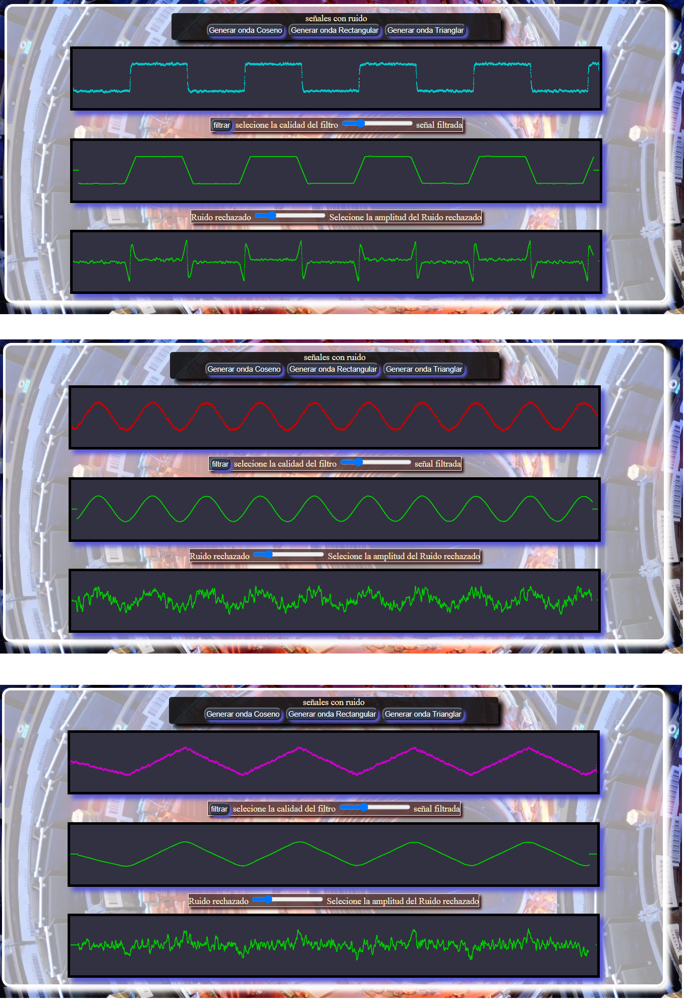

    

# Individual SIMULADOR SEÑALES RUIDO

  

# Proyecto SIMULADOR SEÑALES RUIDO

**Tecnoligias:**
1. javascript
2. html
3. CSS
4.  

### Este proyecto aún está en desarrollo y optimización.

##### Para iniciar :
clonar el repositorio y abrir el archivo index.html con Live Server 
Una vez en el navegador puedes generar señales coseno, rectangular o triangular con ruido aleatorio.
Luego, filtrar la señal, se puede seleccionar la magnitud del filtrado.
El método utilizado para el filtro es la media móvil
El ruido rechazado por el filtro se muestra en el display inferior, la señal filtrada, en el display central y la señal con ruido en el display superior 

